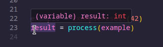
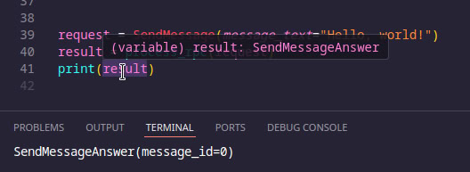

## Motivation

While working with the now-deprecated [MTProto](https://core.telegram.org/mtproto) library [Pyrogram](https://github.com/pyrogram/pyrogram), I encountered a situation where I had to manually type hint the RPC calls' result types.

```python
from pyrogram import Client
from pyrogram.raw.types import DialogFilter
from pyrogram.raw.functions.messages import GetDialogFilters

app = Client(...)
...
folders: list[DialogFilter] = await app.invoke(GetDialogFilters())
```

It wasn't a big deal and I didn't think much of it, I just accepted it as something I had to do to improve the quality of my code and make Mypy errors disappear.

That is, until I switched to the [gramme.rs](https://github.com/Lonami/grammers/) Rust library. I noticed that rust-analyzer could automatically detect the RPC return type without me specifying it, so I dug deeper.

By looking at the source code of the [library on docs.rs](https://docs.rs/grammers-tl-types/0.7.0/grammers_tl_types/functions/messages/struct.GetDialogFilters.html#associatedtype.Return) ([code permalink](https://docs.rs/grammers-tl-types/0.7.0/src/grammers_tl_types/opt/rustwide/target/x86_64-unknown-linux-gnu/debug/build/grammers-tl-types-660ac82ac4208fb4/out/generated.rs.html#64151). warning: huge webpage), I could find this snippet of code:

```rust
#[derive(Debug)]
#[derive(Clone, PartialEq)]
pub struct GetDialogFilters {
}
impl crate::Identifiable for GetDialogFilters {
    const CONSTRUCTOR_ID: u32 = 4023684233;
}
impl crate::Serializable for GetDialogFilters {
    fn serialize(&self, buf: &mut impl Extend<u8>) {
        use crate::Identifiable;
        Self::CONSTRUCTOR_ID.serialize(buf);
    }
}
impl crate::RemoteCall for GetDialogFilters {
    type Return = crate::enums::messages::DialogFilters;
}
```

That's clever! It's a statically defined return type bound to the RPC call struct. Let's replicate this pattern in Python.

> Note: the Rust code uses a `DialogFilters` type instead of a `list[DialogFilter]`, my snippet comes from an older version of the library. The newer version of the protocol uses a `DialogFilters` type, which is a list of `DialogFilter` objects with additional metadata. The `DialogFilter` type is a simple object with a few attributes, so it is not relevant to the purpose of this post.

## Minimal Implementation

```python
from typing import Any, Generic, Protocol, TypeVar

R = TypeVar("R")

class HasResult(Protocol, Generic[R]):
    result: R

T = TypeVar("T", bound=HasResult[Any])

def process(obj: HasResult[R]) -> R:
    return obj.result

class ExampleResult:
    def __init__(self, value: int):
        self.result = value

example = ExampleResult(42)
result = process(example)
```

This is a minimal snippet I came up with. As you can see, the linter can correctly detect the type statically.



While this snippet is fine for most use cases, I wanted to replicate the design pattern more accurately.

## Advanced Implementation

```python
from dataclasses import dataclass
from typing import Any, Generic, Protocol, TypeVar, Type


D = TypeVar("D", covariant=True)
R = TypeVar("R", bound="HasDefault[Any]")


class HasDefault(Protocol, Generic[D]):
    @classmethod
    def default(cls) -> D:
        ...


class HasResult(Protocol, Generic[R]):
    result_type: Type[R]


@dataclass
class SendMessageAnswer:
    message_id: int

    @classmethod
    def default(cls) -> "SendMessageAnswer":
        return cls(message_id=0)


class SendMessage:
    result_type = SendMessageAnswer

    def __init__(self, *, message_text: str):
        self.message_text = message_text


def process_rpc(obj: HasResult[R]) -> R:
    return obj.result_type.default()


request = SendMessage(message_text="Hello, world!")
result = process_rpc(request)
print(result)
```

Notable changes:
- `result_type` is now a `Type[R]` to prevent situations like this:

    ```python
    # Wrong
    class SendMessage:
        result_type: SendMessageAnswer

    # Correct (notice the `=` sign instead of `:`)
    class SendMessage:
        result_type = SendMessageAnswer
    ```
- Added a `.default()` method interface for the sake of demonstration, but in real code this could be a `.deserialize(stream)` method that takes a binary data stream ([MTProto](https://core.telegram.org/mtproto) is a binary protocol) and deserializes it into the expected object.



## Conclusion
This is a simple way to implement generic return types in Python. It is not as powerful as Rust's type system, but it is a good compromise for Python's dynamic nature. For more information on the `Protocol` class, check out the [python documentation](https://typing.python.org/en/latest/spec/protocol.html).

I have a feeling that there could be a better way to implement this, but I haven't investigated it yet. I will update this post accordingly if I will manage to find a better solution.
